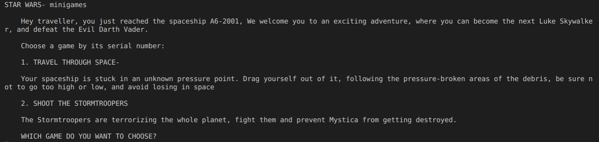
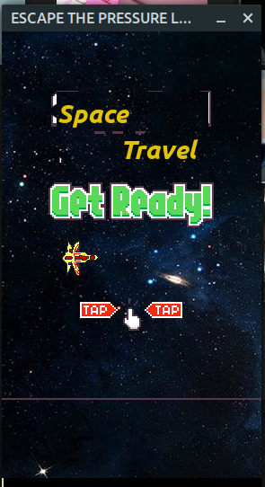
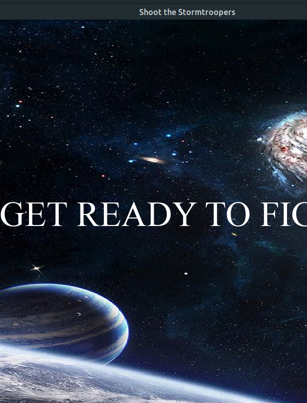

# STAR-WARS MINIGAME

#### A super project made in PyGame

You all have surely heard of *STAR WARS*, the mega-successful film series. It has been a few months since I left learning *PyGame*, and all game dev stuff with Python, and have surely lost a lot of experience. Now I recall my game dev skills (*PRETTY NOOBISH ONES*) once again to make a game in Python. This game's inspired from *STAR WARS* (Though I never saw any of the movies in the series)

<br>

## Features-

- Has 2 relaxing games that are a cure to your stress, anytime in life
- As it's Python, supported in all OS
- The pixel graphics and the old-style interface is bound to burst nostalgia to a 90s arcade gamer

<br>

## Installation and Requirements
 
### Windows and Mac  Users-

- Visit the [Python](https://python.org) website and download your preferred python version. (Here, Python 3.8.8 is recommended)

- Make sure Python is added to PATH 

- Download the [project zip file](https://github.com/arghyagod-coder/STAR-WARS-MINIGAMES/archive/refs/heads/main.zip) and extract it in a folder

- Open the directory through Powershell (Windows) / Terminal (Mac) and follow the commands-

*Windows -*

```
pip install -r requirements.txt
```

*Mac-*

```
pip3 install -r requirements.txt
```

### Linux users-

- Linux disros usually have python installed in them, but if not, you can alternatively do it

*Ubuntu and Derivatives-*

```
$ sudo apt-get update
$ sudo apt-get install software-properties-common
$ sudo add-apt-repository ppa:deadsnakes/ppa
$ sudo apt update
$ sudo apt install python3.8
$ sudo apt install python-pip3
```
Check your installations by running both `python3 -V` and `pip3 -V` in terminal, and if both return versions, congratulations, you installed python successfully

- Now Download the [project zip file](https://github.com/arghyagod-coder/STAR-WARS-MINIGAMES/archive/refs/heads/main.zip) and extract it to a location.

- Run:

```
cd location; pip3 install -r requirements.txt
```

- Now you can run the python file in a code editor ([VS Code](https://code.visualstudio.org), [Sublime Text 3 ](https://sublimetext.com/3), [Thonny](https://thonny.org), [PyCharm](https://jetbrains.com/pycharm) etc.)

<br>

## Usage

### Linux-

```
cd /home/username/Desktop/Folder
python3 main.py
```

Replace 'username' with your home user name, and replace the directory with your current directory

- A start menu will popup



- Choose your game

### Game 1 -



- Click the UP key to start the game

- Follow the Path given by debris

- Avoid touching the skyor falling down

- Keep track of the score in the shell

### Game 2-



- Click your mouse on the window to start the game

- WASD to move, and Space to shoot

- Avoid the lasers and dont miss more than 5 troopers

<br>


## License

[LICENSE](LICENSE)

<br>

## Developer Tools-

#### Python 3.8.8

#### Linux-64 OS

#### Visual Studio Code Text Editor

<br>

## Version Details

**Current Version (Stable)**- 1.2.0

#### Version Advantages

- 1.2.0 Ver has the following new/updated features
   - Updated Controls- No more lagging Bullets
   - Higher FPS Settings ensures smooth gameplay
   - Filesystems Managed
   - Code improved and managed
   - Customizable FPS 

## Credits

- *Ideas-* [Avanindra Chakroborty](https://github.com/AvanindraC) (Friend)

- *Images-*
    - 0 to 9 png Images - [CodeWithHarry](https://codewithharry.com)
    - background_GAME 1 - Google
    - base.png - Self Made (GNU Image Manipulation Program)
    - debris.png - Self Made ([Pixilart](https://pixilart.com))
    - Sounds_Effects - [CodeWithHarry](https://codewithharry.com)
    - Charcter Sprites- Self Made ([Pixilart](https://pixilart.com))
